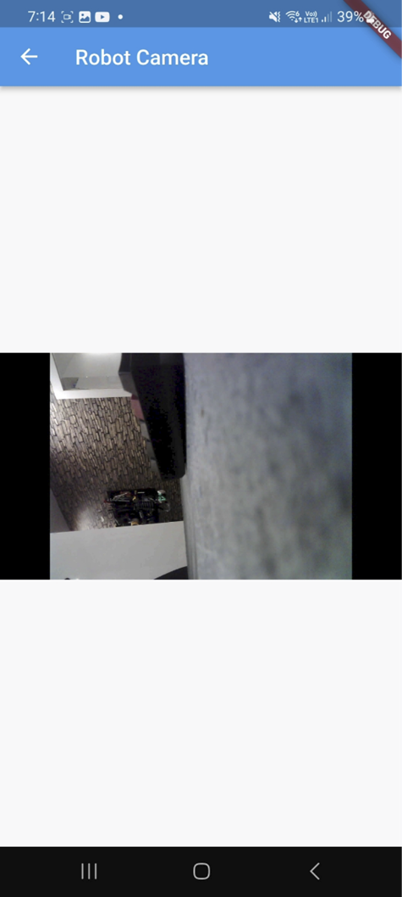

# Home-Security-Robot
Made as part of my Computing BSc Undergrad degree at the University of Portsmouth

This project was originally intended to be open-source and free to use, but I had to wait until I got my grade, so now that I have graduated, I have released the code free to use.

The code used in this project should not be used as a guideline for writing good code. Many of the aspects of this project are things that I had never used before.

### Ultrasonic Sensor Connections

### Motor Driver Connections

### ESP32-CAM Connections for uploading code

The code I used for the ESP32-CAM won't be included, you can get that from this repository https://github.com/rzeldent/esp32cam-rtsp. This upload is only for the Flutter app that connects to the esp32cam and the Arduino Nano driving code. Credits go to the repository listed above for their ESP32-CAM connections diagram.

### The App

The app is quite simple, it uses a VLC player plugin called "flutter_vlc_player" (https://pub.dev/packages/flutter_vlc_player) and simple flutter UI elements. You may notice a menu button in the top left of the app, but it has no functionality. While learning to use Flutter, I played with the different UI elements and thought a menu could serve to add additional functionality. I never added additional functionality but forgot to remove the menu button. 

### The Robot

(I may have a video of the development process coming.)
